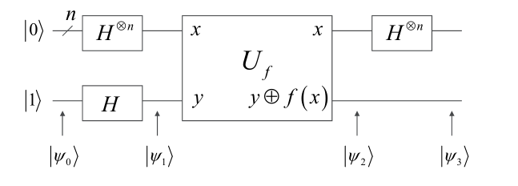

# Deutsch算法

假设某函数$f(x)$，它的定义域是$\{0,1\}^n$ ，即是长度为$n$的01串，它的值域是$\{0,1\}$。而且它只可能是两种，一种是常数函数 ，即$\forall x,f(x)=c,c\in \{0,1\} $；另一种是平衡函数，即有一半的x，使得$f(x)=0$，有另一半$x$，使得$f(x)=1$。问题就是判断$f(x)$是常数函数还是平衡函数。

**传统算法**：至少需要$2^{n-1}+1$次操作，假设验证了$2^{n-1}+1$个$f(x)$的值后，都是某一常数c($c\in \{0,1\}$)，则可知$f(x)$是常数函数，否则是平衡函数。

**量子算法**：用Deutsch算法来判断，仅需一次操作即可知$f(x)$是常数函数还是平衡函数。

**算法线路图**：

上边输入为$|0\rangle^{\otimes n}$，下边输入为$|1\rangle$。

$$
|\psi_{0}\rangle=|0\rangle^{\otimes n}|1\rangle
$$

$$
H^{\otimes n}|x\rangle=\prod_{i=1}^{n}\frac{1}{\sqrt{2}}\sum_{y_{j}\in \{0,1\}}(-1)^{x_{i}y_{j}}|y_{j}\rangle=\frac{1}{2^{n/2}}\sum_{y=0}^{2^{n}-1}(-1)^{x\cdot y}|y\rangle
$$

其中，$x\cdot y=x_{1}y_{1}\oplus x_{2}y_{2}\oplus\cdots\oplus x_{n}y_{n}$

$$
H^{\otimes n}|0\rangle = \sum_{x=0}^{2^{n}-1}\frac{|x\rangle}{\sqrt{2^{n}}}
$$
所以$|\psi_{1}\rangle=\sum_{x=0}^{2^{n}-1}\frac{|x\rangle}{\sqrt{2^{n}}}\cdot\frac{|0\rangle -|1\rangle}{\sqrt{2}}$

经过$U_{f}$的作用后，$x$保持不变，$y$变为$y\oplus f(x)$。因为$y=\frac{|0\rangle -|1\rangle}{\sqrt{2}}$，所以$y\oplus f(x)=\frac{1}{\sqrt{2}}(|f(x)\rangle-|1\oplus f(x)\rangle)$。当$f(x)=0$时，$y\oplus f(x)=\frac{1}{\sqrt{2}}(|0\rangle-|1\rangle)$；当$f(x)=1$时，$y\oplus f(x)=\frac{1}{\sqrt{2}}(|1\rangle-|0\rangle)=-\frac{1}{\sqrt{2}}(|0\rangle-|1\rangle)$。所以$y\oplus f(x)=(-1)^{f(x)}|y\rangle$。

所以$|\psi_{2}\rangle=\sum_{x=0}^{2^{n}-1}\frac{(-1)^{f(x)}}{\sqrt{2^{n}}}|x\rangle\cdot\frac{|0\rangle-|1\rangle}{\sqrt{2}}$。

再经过一次Hadamard变换，$|\psi_{3}\rangle=\frac{1}{2^{n}}\sum_{x=0}^{2^{n}-1}(-1)^{f(x)}\sum_{y=0}^{2^{n}-1}(-1)^{x\cdot y}|y\rangle\cdot\frac{|0\rangle-|1\rangle}{\sqrt{2}}=\frac{1}{2^{n}}\sum_{x=0}^{2^{n}-1}\sum_{y=0}^{2^{n}-1}(-1)^{f(x)+x\cdot y}|y\rangle \cdot\frac{|0\rangle-|1\rangle}{\sqrt{2}}$。

然后只需测量上边部分，如果测量结果为$|0\rangle^{\otimes n}$，则是常数函数，否则是对称函数。

**原理如下**：

对于$|\psi_{3}\rangle$，只考虑前n个qubit，则是$\frac{1}{2^{n}}\sum_{x=0}^{2^{n}-1}\sum_{y=0}^{2^{n}-1}(-1)^{f(x)+x\cdot y}|y\rangle=\frac{1}{2^{n}}\sum_{x=0}^{2^{n}-1}(-1)^{f(x)}\sum_{y=0}^{2^{n}-1}(-1)^{x\cdot y}|y\rangle$。

当$f(x)$是常数函数的时候，考虑$y=0$的部分，$x\cdot y=0,(-1)^{x\cdot y}=1$，所以其系数为$\pm 1$。因为系数的平方的和为1，所以其他态的系数为0。或者对于$y\neq 1$时，则$y$至少有一位为1，不妨假设$y_{i}=1$，当$x$从0求和到$2^{n}-1$时，有一半的$x_{i}$为0，有一半$x_{i}$为1。因为$(-1)^{a\oplus b}=(-1)^{a}\cdot (-1)^{b}$，所以$(-1)^{x_{i}\oplus y_{i}}$的和为0。当有多个$y_{i}$为1时，也是同样道理。所以其前n个qubit为$|0\rangle$。

当$f(x)$是平衡函数时，由常数函数的情况可知，对于$y=0$的部分，$x\cdot y=0,(-1)^{x\cdot y}=1$，而因为$(-1)^{f(x)}$有一半为1，有一半为-1，所以其系数为0。所以对上边的输入进行测量不可能测量到$|0\rangle ^{\otimes n}$。

