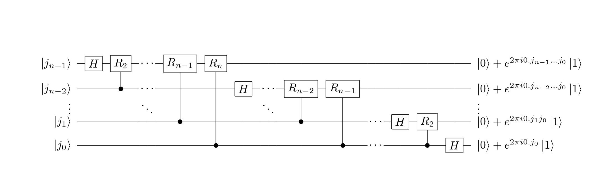

## 离散傅里叶变换(DFT)

对于N点序列$\{x[n]\},0\leq n<N$，其DFT为：$\hat{x}[k]=\sum_{n=0}^{N-1}e^{-i\frac{2\pi}{N}nk}x[n],k=0,1,\ldots,N-1$，记为$\hat{x}=\mathcal{F}\{x\}$，其逆DFT为：$x[n]=\frac{1}{N}\sum_{k=0}^{N-1}e^{i\frac{2\pi}{N}nk}\hat{x}[k],n=0,1,\ldots,N-1$，记为$x=\mathcal{F}^{-1}\{\hat{x}\}$。

将DFT和逆DFT两个式子的两边分别乘$\sqrt{N}$，得$(\sqrt{N}\hat{x}[k])=\sum_{n=0}^{N-1}e^{-i\frac{2\pi}{N}nk}(\sqrt{N}x[n]),k=0,1,\ldots,N-1$与$(\sqrt{N}x[n])=\frac{1}{N}\sum_{k=0}^{N-1}e^{i\frac{2\pi}{N}nk}(\sqrt{N}\hat{x}[k]),n=0,1,\ldots,N-1$。

整理可得：$\hat{x}[k]=\frac{1}{\sqrt{N}}\sum_{n=0}^{N-1}e^{-i\frac{2\pi}{N}nk}(\sqrt{N}x[n]),k=0,1,\ldots,N-1$与$(\sqrt{N}x[n])=\frac{1}{\sqrt{N}}\sum_{k=0}^{N-1}e^{i\frac{2\pi}{N}nk}\hat{x}[k],n=0,1,\ldots,N-1$。

换元可得：逆DFT：$x_{k}=\frac{1}{\sqrt{N}}\sum_{j=0}^{N-1}y_{j}e^{-2\pi ijk/N}$与DFT：$y_{k}=\frac{1}{\sqrt{N}}\sum_{j=0}^{N-1}x_{j}e^{2\pi ijk/N}$，其中$k=0,1,\ldots,N-1$。

## 量子傅里叶变换(QFT)

即用量子线路实现DFT：$\hat{f}(k)=\frac{1}{\sqrt{N}}\sum_{j=0}^{N-1}f(j)e^{2\pi ijk/N},\, k=0,1,\ldots,N-1$。

用量子态表示DFT为：$|\hat{\psi}\rangle=\mathcal{F}(|\psi\rangle),\, |\hat{\psi}\rangle=\sum_{k=0}^{2^{n}-1}\hat{f}(k)|k\rangle,\, |\psi\rangle=\sum_{j=0}^{2^{n}-1}f(j)|j\rangle,\, 2^{n}=N$。

若$\mathcal{F}(|j\rangle)=\frac{1}{\sqrt{2^{n}}}\sum_{k=0}^{2^{n}-1}e^{2\pi ijk/2^{n}}|k\rangle$，则

$$
\begin{equation}
\begin{aligned}
|\hat{\psi}\rangle & = \mathcal{F}(|\psi\rangle) \\
& =\sum_{j=0}^{2^{n}-1}f(j)\mathcal{F}(|j\rangle) \\
&=\frac{1}{\sqrt{2^{n}}}\sum_{j=0}^{2^{n-1}}f(j)\sum_{k=0}^{2^{n}-1}\exp(2\pi ijk/2^{n})|k\rangle \\
& =\frac{1}{\sqrt{2^{n}}}\sum_{k=0}^{2^{n}-1}(\sum_{j=0}^{2^{n}-1}\exp(2\pi ijk/2^{n})f(j)) |k\rangle \\
& =\sum_{k=0}^{2^{n}-1}\hat{f}(k)|k\rangle
\end{aligned}
\end{equation}
$$


所以QFT为：$\mathcal{F}(|j\rangle)=\frac{1}{\sqrt{2^{n}}}\sum_{k=0}^{2^{n}-1}e^{2\pi ijk/2^{n}}|k\rangle$。

## QFT的张量积形式

首先定义$j$的二进制表示，$j=j_{n-1}j_{n-2}\ldots j_{0}=j_{n-1}2^{n-1}+j_{n-2}2^{n-2}+\ldots+j_{0}2^{0}$，对于小数来说，$0.j_{l}j_{l+1}\ldots j_{m}=\frac{1}{2}j_{l}+\frac{1}{2^{2}}j_{l+1}+\ldots +\frac{1}{2^{m-l+1}}j_{m}$。

$$
\begin{equation}
\begin{aligned}
\mathcal{F}(|j\rangle) & =\frac{1}{\sqrt{2^{n}}}\sum_{k=0}^{2^{n}-1}e^{2\pi ijk/2^{n}}|k\rangle \\
& =\frac{1}{\sqrt{2^{n}}}\sum_{k_{n-1}=0}^{1}\ldots\sum_{k_{0}=0}^{1}\exp(2\pi ij\sum_{l=1}^{n}\frac{k_{n-l}}{2^{l}})|k_{n-1}\ldots k_{0}\rangle \\
& =\frac{1}{\sqrt{2^{n}}}\sum_{k_{n-1}=0}^{1}\ldots\sum_{k_{0}=0}^{1}\otimes_{l=1}^{n}\exp(2\pi ij\frac{k_{n-l}}{2^{l}})|k_{n-l}\rangle \\
& =\frac{1}{\sqrt{2^{n}}}\otimes_{l=1}^{n}[\sum_{k_{n-l}=0}^{1}\exp(2\pi ij\frac{k_{n-l}}{2^{l}})|k_{n-l}\rangle] \\
& =\frac{1}{\sqrt{2^{n}}}\otimes_{l=1}^{n}[|0\rangle+\exp(2\pi ij\frac{1}{2^{l}})|1\rangle] \\
& =\frac{1}{\sqrt{2^{n}}}(|0\rangle+e^{2\pi i0.j_{0}}|1\rangle)\otimes(|0\rangle+e^{2\pi i0.j_{1}j_{0}}|1\rangle)\otimes\ldots\otimes(|0\rangle+e^{2\pi i0.j_{n-1}j_{n-2}\ldots j_{0}}|1\rangle)
\end{aligned}
\end{equation}
$$


所以QFT的张量积形式为：$\frac{1}{\sqrt{2^{n}}}(|0\rangle+e^{2\pi i0.j_{0}}|1\rangle)\otimes(|0\rangle+e^{2\pi i0.j_{1}j_{0}}|1\rangle)\otimes\ldots\otimes(|0\rangle+e^{2\pi i0.j_{n-1}j_{n-2}\ldots j_{0}}|1\rangle)$。

解释推导过程的两个问题：

1. $\otimes$本质是一个连乘的符号，所以可以与$\sum$调换位置。
2. 推导过程中，第五行到第六行。因为$j\frac{1}{2^{l}}=j_{n-1}\ldots j_{l+1}.j_{l}\ldots j_{0}$，$\exp(2\pi ij\frac{1}{2^{l}})=\exp(2\pi ij_{n-1}\ldots j_{l+1})*\exp(2\pi i0.j_{l}\ldots j_{0})$，即把$j$拆分为整数部分和小数部分，整数部分是1，所以可以省略，只有小数部分有效。

## QFT的量子线路模型

假设一个量子门$R_{k}=\begin{bmatrix}1&0\\0&\exp(\frac{2\pi i}{2^{k}})\end{bmatrix}$，显然$R_{k}$是一个酉变换。



首先，有$e^{2\pi i0,j_{0}}=e^{\pi ij_{0}}=\left\{\begin{array}{ll}1&j_{0}=0\\-1&j_{0}=1\end{array} \right.$，所以$|0\rangle+e^{2\pi i0,j_{0}}|1\rangle=\left\{\begin{array}{ll}|0\rangle+|1\rangle&j_{0}=0\\|0\rangle-|1\rangle&j_{0}=1\end{array} \right.$，所以用H门即可实现这个变换。

接下来，$e^{2\pi i0.j_{x}\ldots j_{0}}=e^{2\pi i0.j_{x}}*e^{2\pi i0.0j_{x-1}\ldots j_{0}}$，可以看出，这一项只与前x个量子位有关。对于$e^{2\pi i0.j_{x}}$，如前文所述，用H门可以实现，对于$e^{2\pi i0.0j_{x-1}\ldots j_{0}}$，使用受控$R_{k}$门即可得到$j_{k}$，所以整体线路模型如上图所示。

QFT量子线路的latex代码为：

```latex
\documentclass{article}
\usepackage[]{qcircuit}
\newcommand{\ket}[1]{\ensuremath{\left\vert #1 \right\rangle}}
\newcommand{\bra}[1]{\ensuremath{\left\langle{#1}\right\vert}}
\begin{document}
	\Qcircuit@C=0.7em@R=0.7em {
		\lstick{\ket{j_{n-1}}}&\gate{H}&\gate{R_{2}}&\qw&\cdots&   &\gate{R_{n-1}}&\gate{R_n}&\qw     &\qw&\qw   &\qw&\qw           &\qw           &\qw&\qw   &\qw&\qw     &\qw           &\qw     &\rstick{\ket{0}+e^{2\pi i0.j_{n-1}\ldots j_{0}}\ket{1}}\qw \\
		\lstick{\ket{j_{n-2}}}&\qw     &\ctrl{-1}   &\qw&\cdots&   &\qw           &\qw       &\gate{H}&\qw&\cdots&   &\gate{R_{n-2}}&\gate{R_{n-1}}&\qw&\qw   &\qw&\qw     &\qw           &\qw     &\rstick{\ket{0}+e^{2\pi i0.j_{n-2}\ldots j_{0}}\ket{1}}\qw \\
		\lstick{\vdots}       &        &            &   &\ddots&   &              &          &        &   &\ddots&   &              &              &   &      &   &        &              &        &\rstick{\vdots} \\
		\lstick{\ket{j_{1}}}  &\qw     &\qw         &\qw&\qw   &\qw&\ctrl{-3}     &\qw       &\qw     &\qw&\qw   &\qw&\ctrl{-2}     &\qw           &\qw&\cdots&   &\gate{H}&\gate{R_{n-2}}&\qw     &\rstick{\ket{0}+e^{2\pi i0.j_{1}j_{0}}\ket{1}}\qw \\
		\lstick{\ket{j_{0}}}  &\qw     &\qw         &\qw&\qw   &\qw&\qw           &\ctrl{-4} &\qw     &\qw&\qw   &\qw&\qw           &\ctrl{-3}     &\qw&\cdots&   &\qw     &\ctrl{-1}     &\gate{H}&\rstick{\ket{0}+e^{2\pi i0.j_{0}}\ket{1}}\qw
	}
\end{document}
```


