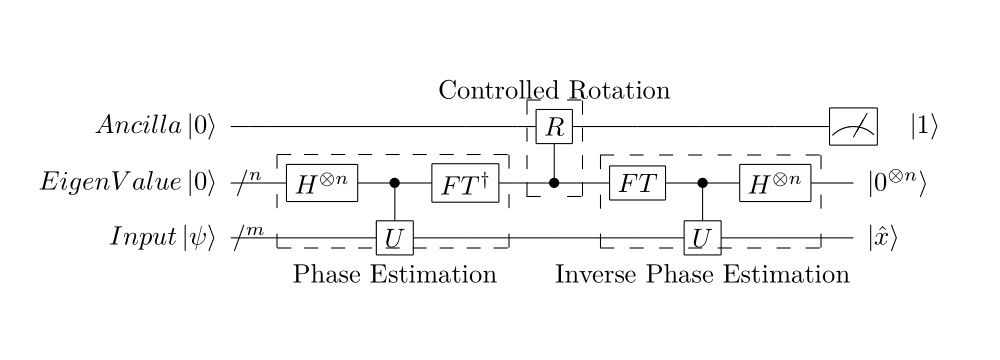
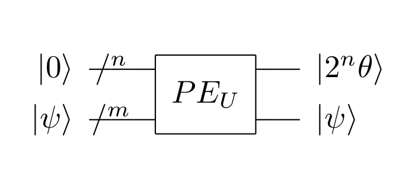

## HHL算法的目标

求解$A\vec{x}=\vec{b}$，其中$A$是$n\times n$的方阵，$\vec{x}$和$\vec{b}$都是$n\times1$的向量。假设矩阵$A$是厄密的（即$A^{\dagger}=A$），则矩阵$e^{iAt}$是酉的（即$AA^{\dagger}=A^{\dagger}A=I$），同时$A$和$e^{iAt}$有相同的特征向量，若$A|u\rangle=\lambda|u\rangle$，则$e^{iAt}|u\rangle=e^{i\lambda t}|u\rangle$。本问题中，还需假设$\|\vec{x}\|=1,\|\vec{b}\|=1$。因为$e^{iAt}$是酉矩阵，所以它有$n$个相互正交的特征向量。本问题中，将问题变形为$A|x\rangle=|b\rangle$，并不完全等同于原问题。

很多地方笔者并没有完全搞懂，故省略了很多推导过程和证明，后面可能会补充。

## HHL算法的量子线路图



其对应的latex代码为：

```latex
\documentclass{article}
\usepackage[]{qcircuit}
\usepackage{ifpdf}
\xyoption{all}
\newcommand{\ket}[1]{\ensuremath{\left\vert #1 \right\rangle}}
\newcommand{\bra}[1]{\ensuremath{\left\langle{#1}\right\vert}}
\begin{document}
	\Qcircuit@C=0.7em@R=0.7em {
		&          &                        &        &                   &   &         &\mbox{Controlled Rotation} \\
		\lstick{Ancilla \ket{0}}   &\qw       &\qw&\qw                 &\qw     &\qw                &\qw&\gate{R} &\qw&\qw      &\qw     &\qw                 &\meter&\rstick{\ket{1}} \\
		\lstick{EigenValue \ket{0}}&\qw{/^{n}}&\qw&\gate{H^{\otimes n}}&\ctrl{1}&\gate{FT^{\dagger}}&\qw&\ctrl{-1}&\qw&\gate{FT}&\ctrl{1}&\gate{H^{\otimes n}}&\rstick{\ket{0^{\otimes n}}}\qw \\
		\lstick{Input \ket{\psi}}  &\qw{/^{m}}&\qw&\qw                 &\gate{U}&\qw                &\qw&\qw      &\qw&\qw      &\gate{U}&\qw&\rstick{\ket{\hat{x}}}\qw 
		\gategroup{3}{4}{4}{6}{.7em}{--}  \gategroup{2}{8}{3}{8}{.7em}{--} \gategroup{3}{10}{4}{12}{.7em}{--}\\
		&&&&\mbox{Phase Estimation}&&&&&&\mbox{Inverse Phase Estimation}
	}
\end{document}
```

<!-- more -->

## HHL的算法解释

第一步：相位估计(Phase Estimation)

首先，有$|b\rangle=\sum_{i=0}^{N-1}b_{i}|i\rangle=\sum_{i=0}^{N-1}\beta_{i}|\mu_{i}\rangle$，其中$\mu_{i}$是$A$（和$e^{iAt}$）的特征向量。然后，因为$U=e^{iAt}$是酉的，故可以用Hamiltonian simulation来制备$U$门。

相位估计的电路图和功能如下：



其对应的latex代码为：

```latex
\documentclass{article}
\usepackage[]{qcircuit}
\usepackage{ifpdf}
\xyoption{all}
\newcommand{\ket}[1]{\ensuremath{\left\vert #1 \right\rangle}}
\newcommand{\bra}[1]{\ensuremath{\left\langle{#1}\right\vert}}
\begin{document}
	\Qcircuit@C=0.7em@R=0.7em {
		\lstick{\ket{0}}   &\qw{/^{n}}&\qw&\multigate{1}{PE_{U}}&\qw&\rstick{\ket{2^{n}\theta}}\qw \\
		\lstick{\ket{\psi}}&\qw{/^{m}}&\qw&\ghost{PE_{U}}       &\qw&\rstick{\ket{\psi}}\qw 
	}
\end{document}
```

具体的实现方式见我的另一篇文章。

相位估计中，$|\psi\rangle$是$U$的特征向量，$U|\psi\rangle=e^{2\pi i\theta}|\psi\rangle$。输出得到$|2^{n}\theta\rangle$。本文中，$U=e^{iAt}$，若$A|\psi\rangle=\lambda|\psi\rangle$，则$U|\psi\rangle=e^{i\lambda t}|\psi\rangle$。因此，在相位估计后，若Eigenvalue的值变为$|\hat{\lambda}\rangle$，则$\hat{\lambda}=2^{n}\frac{\lambda t}{2\pi}$。因此$\hat{\lambda}$与$\lambda$是正比关系。后面就认为$\hat{\lambda}$是对$\lambda$的估计。

相位估计之前，$|\psi\rangle=\sum_{i=0}^{N-1}\beta_{i}|\mu_{i}\rangle$，因此相位估计后，Input与Eigenvalue变为$\sum_{j=0}^{N-1}\beta_{j}|\mu_{j}\rangle|\lambda_{j}\rangle$。

第二步：受控旋转，所有的Qubits变为$\sum_{j=0}^{N-1}\beta_{j}|\mu_{j}\rangle|\lambda_{j}\rangle(\sqrt{1-\frac{C^{2}}{\lambda_{j}}}|0\rangle+\frac{C}{\lambda}|1\rangle)$。

第三步：逆相位估计，得到$\sum_{j=0}^{N-1}\beta_{j}|\mu_{j}\rangle|0\rangle(\sqrt{1-\frac{C^{2}}{\lambda_{j}}}|0\rangle+\frac{C}{\lambda}|1\rangle)$

第四步：对Ancilla进行测量，当得到$|1\rangle$的时候，Input变为$|\hat{x}\rangle=\frac{1}{N_{x'}}\sum_{j=0}^{N-1}\frac{C}{\lambda_{j}}\beta_{j}|\mu_{j}\rangle$，与我们想要的$|x\rangle=\sum_{j=0}^{N-1}\beta_{j}\frac{1}{\lambda_{j}}|\mu_{j}\rangle$成正比关系，故相当于得到了$|x\rangle$。

## 相关证明

1. $A$是厄密矩阵，所以$A$有$n$个相互正交的特征向量，证明$e^{iAt}$是酉矩阵。因为A是Hermitian矩阵，所以存在酉矩阵$U$，使得$D=U^{\dagger}AU$为实对角阵。由矩阵级数的定义可知，$U^{\dagger}e^{iA}U=e^{iU^{\dagger}AU}=e^{iD}$，因为$D$是实对角阵，所以$e^{iD}$也是实对角阵，特征值形如$e^{i\lambda}$，其中$\lambda$是实数（$D$的对角元，$A$的特征值）。由欧拉公式可得$e^{i\lambda}=\cos\lambda+i\sin\lambda$，其复共轭为$\cos\lambda-i\sin\lambda=e^{-i\lambda}$，所以$e^{iD}\times e^{-iD}=E$，所以$e^{iD}$是酉矩阵。所以$e^{iA}=Ue^{iD}U^{\dagger}$也是酉矩阵。

## 参考资料

1. [https://zhidao.baidu.com/question/513908090.html](https://zhidao.baidu.com/question/513908090.html)
2. [https://arxiv.org/abs/0811.3171v3](https://arxiv.org/abs/0811.3171v3)