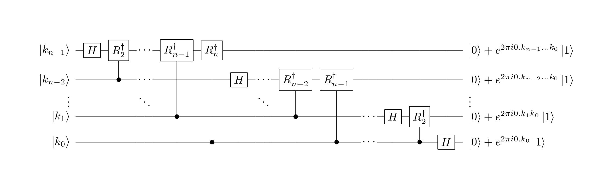
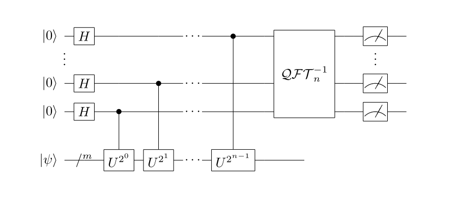

# 相位估计算法(Quantum phase estimation)

## 量子逆傅里叶变换(逆QFT)

数学形式：$f(j)=\frac{1}{\sqrt{N}}\sum_{k=0}^{N-1}\hat{f}(k)\exp(-2\pi ijk/N),\, j=0,1,\ldots,N-1$

量子态形式：$|\psi\rangle=\mathcal{F}^{-1}(|\hat{\psi}\rangle),\, |\hat{\psi}\rangle=\sum_{k=0}^{2^{n}-1}\hat{f}(k)|k\rangle,\, |\psi\rangle=\sum_{j=0}^{2^{n}-1}f(j)|j\rangle,\, 2^{n}=N$

若$\mathcal{F}^{-1}(|k\rangle)=\frac{1}{\sqrt{2^{n}}}\sum_{j=0}^{2^{n}-1}\exp(-2\pi ijk/2^{n})|j\rangle$，则
$$
\begin{equation}
\begin{aligned}
|\psi\rangle & =\mathcal{F}^{-1}(|\hat{\psi}\rangle) \\
& =\sum_{k=0}^{2^{n}-1}\hat{f}(k)\mathcal{F}^{-1}(|k\rangle) \\
& =\frac{1}{\sqrt{2^{n}}}\sum_{k=0}^{2^{n}-1}\hat{f}(k)\sum_{j=0}^{2^{n}-1}\exp(-2\pi ijk/2^{n})|j\rangle \\
& =\frac{1}{\sqrt{2^{n}}}\sum_{j=0}^{2^{n}-1}(\sum_{k=0}^{2^{n}-1}\hat{f}(k)\exp(-2\pi ijk/2^{n}))|j\rangle \\
& =\sum_{j=0}^{2^{n}-1}f(j)|j\rangle
\end{aligned}
\end{equation}
$$

所以，逆QFT为：$\mathcal{F}^{-1}(|k\rangle)=\frac{1}{\sqrt{2^{n}}}\sum_{j=0}^{2^{n}-1}\exp(-2\pi ijk/2^{n})|j\rangle$

<!-- more -->

## 逆QFT的张量积形式

定义$k$的二进制表示，$k=k_{n-1}k_{n-2}\ldots k_{0}=k_{n-1}2^{n-1}+k_{n-2}2^{n-2}+\ldots +k_{0}2^{0}$，对于小数来说，$0.k_{l}k_{l+1}\ldots k_{m}=\frac{1}{2}k_{l}+\frac{1}{2^{2}}k_{l+1}+\ldots +\frac{1}{2^{m-l+1}}k_{m}$。
$$
\begin{equation}
\begin{aligned}
\mathcal{F}^{-1}(|k\rangle)& =\frac{1}{\sqrt{2^{n}}}\sum_{j=0}^{2^{n}-1}\exp(-2\pi ijk/2^{n})|j\rangle \\
& =\frac{1}{\sqrt{2^{n}}}\sum_{j_{n-1}=0}^{1}\ldots\sum_{j_{0}=0}^{1}\exp(-2\pi ik\sum_{l=1}^{n}\frac{j_{n-l}}{2^{l}})|j_{n-1}\ldots j_{0}\rangle \\
& =\frac{1}{\sqrt{2^{n}}}\sum_{j_{n-1}=0}^{1}\ldots\sum_{j_{0}=0}^{1}\otimes_{l=1}^{n}\exp(-2\pi ik\frac{j_{n-l}}{2^{l}})|j_{n-l}\rangle \\
& =\frac{1}{\sqrt{2^{n}}}\otimes_{l=1}^{n}[\sum_{j_{n-l}=0}^{1}\exp(-2\pi ik\frac{j_{n-l}}{2^{l}})|j_{n-l}\rangle] \\
& =\frac{1}{\sqrt{2^{n}}}\otimes_{l=1}^{n}[|0\rangle+\exp(-2\pi ik\frac{1}{2^{l}})|1\rangle] \\
& =\frac{1}{\sqrt{2^{n}}}(|0\rangle+e^{-2\pi i0.k_{0}}|1\rangle)\otimes(|0\rangle+e^{-2\pi i0.k_{1}k_{0}}|1\rangle)\otimes\ldots\otimes(|0\rangle+e^{-2\pi i0.k_{n-1}k_{n-2}\ldots k_{0}}|1\rangle)
\end{aligned}
\end{equation}
$$

## 逆QFT的量子线路模型

假设量子门$R_{k}^{\dagger}=\begin{bmatrix}1&0\\0&\exp(\frac{-2\pi i}{2^{k}})\end{bmatrix}$，与QFT类似可得逆QFT的量子线路图。



其latex代码为：

```latex
\documentclass{article}
\usepackage[]{qcircuit}
\usepackage{ifpdf}
\xyoption{all}
\newcommand{\ket}[1]{\ensuremath{\left\vert #1 \right\rangle}}
\newcommand{\bra}[1]{\ensuremath{\left\langle{#1}\right\vert}}
\begin{document}
	\Qcircuit@C=0.7em@R=0.7em {
		\lstick{\ket{k_{n-1}}}&\gate{H}&\gate{R_{2}^{\dagger}}&\qw&\cdots&   &\gate{R_{n-1}^{\dagger}}&\gate{R_{n}^{\dagger}}&\qw     &\qw&\qw   &\qw&\qw           &\qw           &\qw&\qw   &\qw&\qw     &\qw           &\qw     &\rstick{\ket{0}+e^{2\pi i0.k_{n-1}\ldots k_{0}}\ket{1}}\qw \\
		\lstick{\ket{k_{n-2}}}&\qw     &\ctrl{-1}   &\qw&\cdots&   &\qw           &\qw       &\gate{H}&\qw&\cdots&   &\gate{R_{n-2}^{\dagger}}&\gate{R_{n-1}^{\dagger}}&\qw&\qw   &\qw&\qw     &\qw           &\qw     &\rstick{\ket{0}+e^{2\pi i0.k_{n-2}\ldots k_{0}}\ket{1}}\qw \\
		\lstick{\vdots}       &        &            &   &\ddots&   &              &          &        &   &\ddots&   &              &              &   &      &   &        &              &        &\rstick{\vdots} \\
		\lstick{\ket{k_{1}}}  &\qw     &\qw         &\qw&\qw   &\qw&\ctrl{-3}     &\qw       &\qw     &\qw&\qw   &\qw&\ctrl{-2}     &\qw           &\qw&\cdots&   &\gate{H}&\gate{R_{2}^{\dagger}}&\qw     &\rstick{\ket{0}+e^{2\pi i0.k_{1}k_{0}}\ket{1}}\qw \\
		\lstick{\ket{k_{0}}}  &\qw     &\qw         &\qw&\qw   &\qw&\qw           &\ctrl{-4} &\qw     &\qw&\qw   &\qw&\qw           &\ctrl{-3}     &\qw&\cdots&   &\qw     &\ctrl{-1}     &\gate{H}&\rstick{\ket{0}+e^{2\pi i0.k_{0}}\ket{1}}\qw
	}
\end{document}
```


## 量子相位估计

假设某一酉算符$U$，它的本征态是$|\psi\rangle$，且$U|\psi\rangle=\lambda|\psi\rangle$，即$|\psi\rangle$对应的本征值是$\lambda$。量子相位估计即是估计$\lambda$，不妨假设$\lambda=\exp 2\pi i\theta$，估计$\theta$即可估计$\lambda$。由于$U^{\dagger}U=I$（$U$是酉矩阵），所以$\langle\psi|U^{\dagger}U|\psi\rangle=\langle\psi|\psi\rangle$，$\langle\psi|U^{\dagger}U|\psi\rangle=\langle\psi|\lambda^{*}\lambda|\psi\rangle=|\lambda|^{2}\langle\psi|\psi\rangle$，所以$|\lambda|^{2}=1$。故可设$\lambda=\exp(2\pi i\theta),0\leq\theta<1$，所以，通过估计$\theta$即可估计$\lambda$。

其线路模型如下：



对应latex代码为：

```latex
\documentclass{article}
\usepackage[]{qcircuit}
\usepackage{ifpdf}
\xyoption{all}
\newcommand{\ket}[1]{\ensuremath{\left\vert #1 \right\rangle}}
\newcommand{\bra}[1]{\ensuremath{\left\langle{#1}\right\vert}}
\begin{document}
	\Qcircuit@C=0.7em@R=0.7em {
		\lstick{\ket{0}}   &\gate{H}  &\qw             &\qw             &\qw&\cdots&&\ctrl{7}          &\qw&\multigate{4}{\mathcal{QFT}_{n}^{-1}}&\qw&\qw&\meter&\qw&\qw \\
		\vdots             &          &                &                &   &      &&                  &   &                                     &   &   &\vdots \\
		\\
		\lstick{\ket{0}}   &\gate{H}  &\qw             &\ctrl{4}        &\qw&\cdots&&\qw               &\qw&\ghost{\mathcal{QFT}_{n}^{-1}}       &\qw&\qw&\meter&\qw&\qw \\
		\lstick{\ket{0}}   &\gate{H}  &\ctrl{3}        &\qw             &\qw&\cdots&&\qw               &\qw&\ghost{\mathcal{QFT}_{n}^{-1}}       &\qw&\qw&\meter&\qw&\qw \\
		\\
		\\
		\lstick{\ket{\psi}}&\qw{/^{m}}&\gate{U^{2^{0}}}&\gate{U^{2^{1}}}&\qw&\cdots&&\gate{U^{2^{n-1}}}&\qw&\qw
	}
\end{document}
```

首先假设$|\psi\rangle$包含$m$个量子比特，上半部分初始为$n$个状态为$|0\rangle$的量子比特。

这$n$个量子比特分别经过H门后变为$\frac{1}{\sqrt{2^{n}}}(|0\rangle+|1\rangle)^{\otimes n}$。

对于$U$门，因为$U|\psi\rangle=\exp(2\pi i\theta)|\psi\rangle$，所以$U^{2^{j}}|\psi\rangle=U^{2^{j}-1}U|\psi\rangle=U^{2^{j}-1}e^{2\pi i\theta}|\psi\rangle=e^{2\pi i2^{j}\theta}|\psi\rangle$。

当$C-U^{2^{j}}$作用在$\frac{1}{\sqrt{2}}(|0\rangle+|1\rangle)\otimes|\psi\rangle$上后，该量子态变为$\frac{1}{\sqrt{2}}(|0\rangle\otimes|\psi\rangle+e^{2\pi i2^{j}\theta}|1\rangle|\psi\rangle)=\frac{1}{\sqrt{2}}(|0\rangle+e^{2\pi i2^{j}\theta}|1\rangle|)\otimes|\psi\rangle$。

所以在这些$C-U^{2^{j}}$门作用完之后，前n个量子比特变为$\frac{1}{\sqrt{2^{n}}}(|0\rangle+e^{2\pi i2^{n-1}\theta}|1\rangle|)\otimes\cdots\otimes(|0\rangle+e^{2\pi i2^{1}\theta}|1\rangle|)\otimes(|0\rangle+e^{2\pi i2^{0}\theta}|1\rangle|)=\frac{1}{\sqrt{2^{n}}}\sum_{k=0}^{2^{n}-1}\exp(2\pi i\theta k)|k\rangle$。

对其运用逆QFT之后，变为$\frac{1}{2^{n}}\sum_{j=0}^{2^{n}-1}\sum_{k=0}^{2^{n}-1}e^{2\pi i\theta k}e^{-2\pi i\theta k/2^{n}}|j\rangle=\sum_{j=0}^{2^{n}-1}(\frac{1}{2^{n}}\sum_{k=0}^{2^{n}-1}e^{-2\pi ik(j-2^{n}\theta)})|j\rangle$。

整体的量子态在该量子线路作用完后变为：$\sum_{j=0}^{2^{n}-1}(\frac{1}{2^{n}}\sum_{k=0}^{2^{n}-1}e^{-2\pi ik(j-2^{n}\theta)})|j\rangle\otimes|\psi\rangle$。

当$\theta$可以用$n$位二进制来表示的时候，即$\theta=0.\theta_{n-1}\theta_{n-2}\cdots\theta_{0}$，因为$j$取值从$0$到$2^{n}-1$，所以$\exists j,j=2^{n}\theta$，故该状态的系数为$1$，其他状态的系数为$0$。所以前$n$个量子比特变为$|j\rangle$，故对其测量即可得到$j$，从而得到$\theta$。

